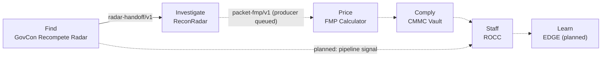

# TENS HQ

**Six small, connected modules modeling the federal-contracting capture lifecycle — find,
investigate, price, comply, staff, learn — five shipped as live apps today, the sixth planned,
each built to ship independently and wired together by typed contracts instead of a shared
codebase.**

TENS HQ (Traversing Ecosystems Navigation & Strategy Headquarters) is a federation, not a
monolith: five of six modules are live public repos with deployed apps today; the sixth
(EDGE) is planned. This repo is the front door — the map, the lifecycle, and the vendored
proof that the "federation" claim is real, not marketing.

## Why this exists

Federal-contracting business development runs on six distinct, hard problems: finding the
right recompetes to chase, building an evidence-backed case for one, pricing it defensibly,
keeping compliance honest, staffing it realistically, and — over time — learning which
pursue/pass calls actually paid off. Those are six different jobs with six different trust
boundaries. Rather than force them into one dashboard, each got its own small app with a
narrow job and an honest, undersell-not-oversell posture — five live today, the sixth (a
learn-from-outcomes calibration layer) planned. The interesting engineering problem turned
out not to be any single app — it's the seams between them: versioned JSON contracts that
cross a process boundary without crossing a trust boundary, re-verified on arrival every
time, never blindly trusted.

## The lifecycle

The one solid arrow (`radar-handoff/v1`) is a shipped, tested contract with both sides live
today. Dashed arrows are the designed lifecycle order — either a half-shipped contract
(`packet-fmp/v1`: consumer shipped and golden-tested, producer still queued in ReconRadar) or
a not-yet-automated step. Nothing here claims data flows that don't.

## The six modules

| Module | Stage | What it does | Repo | Live app |
|---|---|---|---|---|
| **GovCon Recompete Radar** | Find | Surfaces expiring DoD cyber/IT contracts with honest, defensible forward signals — no fabricated recompete labels | [CJud25/GovConRadar](https://github.com/CJud25/GovConRadar) | [Live app](https://govconradar.streamlit.app/) |
| **ReconRadar** | Investigate | Builds a cited, provenance-tracked evidence packet per opportunity — score-free; a human decides | [CJud25/ReconRadar](https://github.com/CJud25/ReconRadar) | [Live app](https://reconradar.streamlit.app/) |
| **FMP Calculator** | Price | Produces a low/med/high fair-market-price band with every number cited — assistive, never "the" FMP | [CJud25/FMP-Calculator](https://github.com/CJud25/FMP-Calculator) | [Live app](https://fmp-calculator.streamlit.app/) |
| **CMMC Vault** | Comply | Scores CMMC Level 2 readiness against NIST SP 800-171 — a high control count is not the same as ready | [CJud25/CMMCVault](https://github.com/CJud25/CMMCVault) | [Live app](https://cmmcvault-demo.streamlit.app/) |
| **ROCC** (Recruiting & Outreach Control Center) | Staff | Aggregates recruiting/outreach signal by source and contract on **synthetic demo data** — scores sources and contracts, never people | [CJud25/ROCC](https://github.com/CJud25/ROCC) | [Live app](https://controlcenter.streamlit.app/) |
| **EDGE** | Learn | *Planned.* Logs every pursue/pass decision and its factors to calibrate judgment over time — starts as a logging habit, not an app | — not started | — |

## Integration contracts — how the apps actually talk to each other

Every contract is a versioned JSON file, parsed offline, fail-closed on a schema-version
mismatch, and re-verified on arrival — never trusted just because it crossed the wire.

### `radar-handoff/v1` — GovCon Recompete Radar → ReconRadar
**Shipped, both sides live.** An analyst downloads a snapshot from GovCon Recompete Radar and
uploads it into ReconRadar's Opportunity Packet. It carries PIID, NAICS/PSC, obligation and
ceiling amounts, period and place of performance — as *claims from a snapshot*, never as
packet evidence. ReconRadar's parser fails closed on any wrong schema version, and the
handoff never feeds ReconRadar's own eligibility or capture-window logic; it renders as a
labeled, caveat-first "Origin" section.
→ [`contracts/radar-handoff-v1/`](contracts/radar-handoff-v1/)

### `packet-fmp/v1` — ReconRadar → FMP Calculator
**Consumer shipped and tested against golden vectors; producer queued in ReconRadar.** A
versioned handoff carrying the *observed, public* portion of a pricing scenario — wage-
determination labor lines, product lines, contract context — while internal rates (overhead,
G&A, net proceeds) stay analyst-entered and session-only, never transmitted. FMP Calculator's
consumer re-verifies every field and builds the identical `Scenario` object manual entry
produces. It's tested against a shared golden-vector pack, designed so the future ReconRadar
producer can prove correctness the same way: reproduce the same ledger.
→ [`contracts/packet-fmp-v1/`](contracts/packet-fmp-v1/)

### Planned: Radar → ROCC pipeline signal
Not built. No schema exists yet. A future contract would let GovCon Recompete Radar's pipeline
inform ROCC's recruiting-push planning.

## Why federation, not one app

Recruiting and compliance data don't belong in the same trust boundary as public-procurement
scraping — a screening tool's confidence shouldn't silently leak into an evidence packet's
citations. Small, separate apps also fail, deploy, and demo independently; one large app
doesn't. The seam that makes the "federation" claim credible isn't a shared database — it's a
versioned JSON contract, re-verified on arrival every time, the same pattern distributed
systems use at any scale. And practically: small, separate Streamlit apps fit the free hosting
tier's per-app resource ceiling better than one large one would.

## Status

| | |
|---|---|
| **Live now** | GovCon Recompete Radar · ReconRadar · FMP Calculator · CMMC Vault (frozen demo) · ROCC (synthetic demo) |
| **Planned** | EDGE — starts as a decision-logging habit in the pilot, before any app is built |
| **Contract shipped** | `radar-handoff/v1` (both sides) |
| **Contract half-shipped** | `packet-fmp/v1` (consumer shipped; ReconRadar producer queued) |
| **Contract not started** | Radar → ROCC pipeline signal |

> All five live apps run on Streamlit Community Cloud's free tier, which sleeps idle apps. If
> a link above shows a "waking up" screen, give it under a minute.

## About this portfolio

Built by [Chris Judkins](https://github.com/CJud25) — a self-taught Power Platform / AI-
automation builder working in federal-contracting compliance and business development,
AI-102 certified. Every shipped module above shares the same discipline: a typed contract at
each boundary, an honesty invariant that survives into the UI (a band, not a point estimate; a
packet, not a score; aggregates, not people), and an adversarial review pass before anything
ships — and the one still on the drawing board (EDGE) will be held to the same rules. Start
with whichever stage interests you — each repo's own README covers that module in depth.

## License

MIT — see [LICENSE](LICENSE). Each module repo carries its own MIT license; none of these
tools are affiliated with the U.S. AbilityOne Commission, SourceAmerica, NIB, DoD, or any
other agency or organization they analyze public data about.
